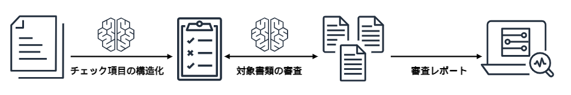

# Review & Assessment Powered by Intelligent Documentation

[English](./docs/en/README_en.md) | [日本語](./README.md)

このサンプルは生成 AI (Amazon Bedrock) を活用した書類審査ソリューションです。膨大な書類と複雑なチェックリストによる審査業務を、Human in the Loop アプローチで効率化します。チェックリストの構造化から AI による審査、そして人間の最終判断までの一連のプロセスをサポートし、審査時間の短縮と品質向上を実現します。



> [!Important]
> このツールは意思決定支援のみを目的としており、専門的判断や法的助言を提供するものではありません。すべての最終判断は適切な資格を持つ人間の専門家が行う必要があります。

> [!Warning]
> 本サンプルは予告なく破壊的な変更を行う恐れがあります。

## 主なユースケース

### 製品仕様書の要件適合レビュー

製品開発における仕様書が、要求仕様や業界標準を満たしているかを効率的に確認します。年間数千件に及ぶ仕様書を、数百の確認項目と照合する作業を自動化。AI が仕様書から関連情報を抽出・構造化し、要件との照合結果を可視化。レビュアーは効率的に最終確認を行えます。

### 技術マニュアルの品質確認

複雑な技術マニュアルが社内ガイドラインや業界標準に準拠しているかを確認します。年間数万ページの技術文書を、数千項目の品質基準と照合する作業を支援。必要な技術情報の記載漏れや矛盾を自動検出し、一貫性のある高品質なマニュアル作成をサポートします。

### 調達文書のコンプライアンス確認

調達文書や提案書が必要な要件を満たしているかをチェックします。数百ページにわたる文書から必要情報を自動抽出し、年間数万件のドキュメントレビューを効率化。要件リストとの照合結果を人間が最終確認することで、調達プロセスのスピードと精度を向上させます。

## スクリーンショット


## デプロイ方法

デプロイには以下の 2 つの方法があります：

### 1. CloudShell を使用したデプロイ（簡単に始めたい方向け）

ローカル環境の準備が不要で、AWS CloudShell を使用してブラウザから簡単に直接デプロイできる方法です。

1. **Amazon Bedrock モデルの有効化**

   AWS Management Console から [Bedrock モデルアクセス](https://us-west-2.console.aws.amazon.com/bedrock/home?region=us-west-2#/modelaccess)にアクセスし、以下のモデルへのアクセスを有効化してください：

   - Anthropic Claude 3.7 Sonnet
   - Amazon Nova Premier

   オレゴン (us-west-2) リージョンでモデルアクセスを有効化してください。

2. **AWS CloudShell を開く**

   [AWS CloudShell](https://console.aws.amazon.com/cloudshell/home)をデプロイしたいリージョンで開きます。

3. **デプロイスクリプトの実行**

   ```bash
   git clone https://github.com/aws-samples/review-and-assessment-powered-by-intelligent-documentation.git
   cd review-and-assessment-powered-by-intelligent-documentation
   ./bin.sh
   ```

   このスクリプトは、CloudShell を使用して、アプリケーションを自動的にデプロイします。

4. **カスタムパラメータの指定（オプション）**

   ```bash
   ./bin.sh --ipv4-ranges '["192.168.0.0/16"]'
   ```

   利用可能なオプション：

   - `--ipv4-ranges`: フロントエンド WAF で許可する IPv4 アドレス範囲（JSON 配列形式）
   - `--ipv6-ranges`: フロントエンド WAF で許可する IPv6 アドレス範囲（JSON 配列形式）
   - `--disable-ipv6`: IPv6 サポートを無効にする
   - `--auto-migrate`: デプロイ時に自動的にデータベースマイグレーションを実行するかどうか
   - `--cognito-self-signup`: Cognito User Pool のセルフサインアップを有効にするかどうか（true/false）
   - `--cognito-user-pool-id`: 既存の Cognito User Pool ID（指定しない場合は新規作成）
   - `--cognito-user-pool-client-id`: 既存の Cognito User Pool Client ID（指定しない場合は新規作成）
   - `--cognito-domain-prefix`: Cognito ドメインのプレフィックス（指定しない場合は自動生成）
   - `--repo-url`: デプロイするリポジトリの URL
   - `--branch`: デプロイするブランチ名

5. **デプロイ後の確認**

   デプロイが完了すると、フロントエンド URL と API の URL が表示されます。
   表示された URL にアクセスして、アプリケーションを利用開始できます。

> [!Important]
> このデプロイ方法では、オプションパラメータを設定しない場合、URL を知っている誰でもサインアップできます。本番環境での使用には、IP アドレス制限の追加やセルフサインアップの無効化 (`--cognito-self-signup=false`) を強くお勧めします。

### 2. ローカル環境からのデプロイ（カスタマイズが必要な場合に推奨）

- このリポジトリをクローン

```
git clone https://github.com/aws-samples/review-and-assessment-powered-by-intelligent-documentation.git
```

- npm パッケージのインストール

```
cd review-and-assessment-powered-by-intelligent-documentation
cd cdk
npm ci
```

- 必要に応じて、[parameter.ts](./cdk/parameter.ts) を編集してください。詳細は[パラメータカスタマイズ](#パラメータカスタマイズ)をご覧ください。
- CDK をデプロイする前に、デプロイ先のリージョンに対して一度ブートストラップを実行する必要があります。

```
npx cdk bootstrap
```

- サンプルプロジェクトをデプロイ

```
npx cdk deploy --require-approval never --all
```

- 以下のような出力が表示されます。Web アプリの URL は `RapidStack.FrontendURL` に出力されますので、ブラウザからアクセスしてください。

```sh
 ✅  RapidStack

✨  deployment time: 78.57s

Output:
...
RapidStack.FrontendURL = https://xxxxx.cloudfront.net
```

## パラメータカスタマイズ

CDK デプロイ時に以下のパラメータをカスタマイズできます:

| パラメータグループ   | パラメータ名             | 説明                                                                                         | デフォルト値                              |
| -------------------- | ------------------------ | -------------------------------------------------------------------------------------------- | ----------------------------------------- |
| **WAF 設定**         | allowedIpV4AddressRanges | フロントエンド WAF で許可する IPv4 範囲                                                      | ["0.0.0.0/1", "128.0.0.0/1"] (すべて許可) |
|                      | allowedIpV6AddressRanges | フロントエンド WAF で許可する IPv6 範囲                                                      | ["0000::/1", "8000::/1"] (すべて許可)     |
| **Cognito 設定**     | cognitoUserPoolId        | 既存の Cognito User Pool ID                                                                  | 新規作成                                  |
|                      | cognitoUserPoolClientId  | 既存の Cognito User Pool Client ID                                                           | 新規作成                                  |
|                      | cognitoDomainPrefix      | Cognito ドメインのプレフィックス                                                             | 自動生成                                  |
|                      | cognitoSelfSignUpEnabled | Cognito User Pool のセルフサインアップを有効にするかどうか                                   | true (有効)                               |
| **マイグレーション** | autoMigrate              | デプロイ時に自動的にマイグレーションを実行するかどうか                                       | true (自動実行する)                       |
| **MCP 機能**         | mcpAdmin                 | MCP ランタイム Lambda 関数に管理者権限を付与するかどうか ([詳細](./docs/ja/mcp-features.md)) | false (無効)                              |

設定するには`cdk/lib/parameter.ts` ファイルを直接編集してください。

> [!CAUTION]
> 本番環境では、`cognitoSelfSignUpEnabled: false` に設定することでセルフサインアップを無効化することを強く推奨します。セルフサインアップを有効にしたままにすると、誰でもアカウント登録が可能となるため、セキュリティリスクとなる可能性があります。
> デフォルトでは `autoMigrate` パラメータが `true` に設定されており、デプロイ時に自動的にデータベースマイグレーションが実行されます。本番環境や重要なデータを含む環境では、このパラメータを `false` に設定し、マイグレーションを手動で制御することを検討してください。

## 開発者向け情報

- [開発者ガイド](./docs/developer-guide.md): 技術仕様、アーキテクチャ、開発環境設定

## コンタクト

- [Takehiro Suzuki](https://github.com/statefb)
- [Kenta Sato](https://github.com/kenta-sato3)

## ライセンス

本プロジェクトは [LICENSE](./LICENSE) に記載されたライセンスの下で配布されています。
