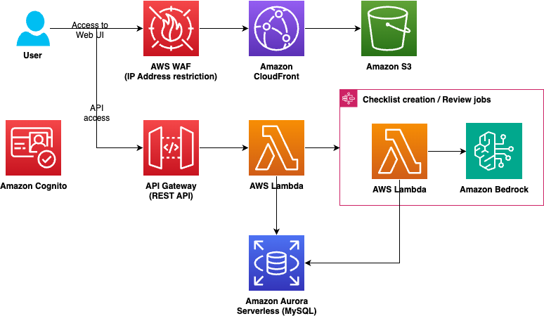

# 開発者ガイド

このガイドは 本サンプルの開発者向け情報をまとめたものです。

> [!Note]
> このリポジトリのコードは８割以上が生成 AI コーディングツールである[Amazon Q Developer CLI](https://docs.aws.amazon.com/amazonq/latest/qdeveloper-ug/command-line.html)および[Cline](https://github.com/cline/cline) with Bedrock で書かれています。サンプルのカスタマイズの際に検討をおすすめします。

## 目次

- [アーキテクチャ](#アーキテクチャ)
- [技術スタック](#技術スタック)
- [ローカル開発環境](#ローカル開発環境)
- [コード規約](#コード規約)
- [テスト](#テスト)
- [デプロイ](#デプロイ)
- [パラメータカスタマイズ](#パラメータカスタマイズ)

## アーキテクチャ



アーキテクチャの概要:

1. **フロントエンド**:

   - [Amazon S3](https://aws.amazon.com/s3/) でホストされた [React](https://react.dev/) アプリケーション
   - [Amazon CloudFront](https://aws.amazon.com/cloudfront/) による配信
   - [AWS WAF](https://aws.amazon.com/waf/) によるセキュリティ保護

2. **認証/認可**:

   - [Amazon Cognito](https://aws.amazon.com/cognito/) による認証管理

3. **API レイヤー**:

   - [Amazon API Gateway](https://aws.amazon.com/api-gateway/)
   - [AWS Lambda](https://aws.amazon.com/lambda/) + [AWS Lambda Web Adapter](https://github.com/awslabs/aws-lambda-web-adapter) による [Fastify](https://fastify.dev/) REST API

4. **処理レイヤー**:

   - [AWS Step Functions](https://aws.amazon.com/step-functions/) による文書処理ワークフロー
   - [AWS Lambda](https://aws.amazon.com/lambda/)関数によるドキュメント分析
   - [Amazon Bedrock](https://aws.amazon.com/bedrock/) による AI/ML 処理

5. **データレイヤー**:
   - [Amazon RDS/Aurora](https://aws.amazon.com/jp/rds/) (MySQL) によるデータベース
   - [Amazon S3](https://aws.amazon.com/s3/) によるドキュメントストレージ

## ローカル開発環境

### 前提条件

- Node.js (v22 推奨)
- Docker と Docker Compose
- AWS CLI

### 環境構築

事前に CDK によるデプロイを行った後、下記の手順を行ってください。

1. **ローカルデータベースの起動**

   ```bash
   # ルートディレクトリで実行
   docker-compose -f assets/local/docker-compose.yml up -d
   ```

2. **バックエンドの準備**

   ```bash
   cd backend
   npm ci

   # Prisma クライアントの生成
   npm run prisma:generate

   # 開発サーバー起動
   npm run dev
   ```

3. **フロントエンドの準備**

   ```bash
   cd frontend
   npm ci

   # 環境変数の設定
   cp .env.example .env.local
   # CDKデプロイ後の値に応じて.env.local を編集

   # 開発サーバー起動
   npm run dev
   ```

## コード規約

[.amazonq/rules](../../.amazonq/rules)を参照してください。

## DB リセット（環境のクリーンアップ）

DB をリセットする必要がある場合は、以下のコマンドでリセットできます：

```bash
# リセットコマンドを取得して実行
RESET_COMMAND=$(aws cloudformation describe-stacks --stack-name RapidStack --query "Stacks[0].Outputs[?OutputKey=='ResetMigrationCommand'].OutputValue" --output text)
eval $RESET_COMMAND
```

> [!Warning]
> これにより、データベースのすべてのデータが削除されます。本番環境では絶対に実行しないでください。

## トラブルシューティング

1. **Docker 関連の問題**

   - macOS でデプロイする場合、Docker が起動していることを確認してください。
   - CDK は Lambda 関数のビルドに Docker を使用します。

2. **マイグレーションエラー**

   - 自動マイグレーションが失敗した場合は、CloudWatch Logs で「MigrationProviderLambda」関数のログを確認してください。
   - 問題が解決しない場合は、以下の方法で手動実行を試みることができます：

     **AWS CLI を使用**:

     ```bash
     # StackのOutputからマイグレーションコマンドを取得して実行
     MIGRATION_COMMAND=$(aws cloudformation describe-stacks --stack-name RapidStack --query "Stacks[0].Outputs[?OutputKey=='DeployMigrationCommand'].OutputValue" --output text)
     eval $MIGRATION_COMMAND
     ```

     **AWS Management Console を使用**:

     1. AWS Management Console で、Lambda サービスに移動
     2. `RapidStack-PrismaMigrationMigrationFunction~` という名前の Lambda 関数を検索して選択
     3. 「テスト」タブを選択
     4. 以下の JSON をテストイベントとして設定
        ```json
        {
          "command": "deploy"
        }
        ```
     5. 「テスト」ボタンをクリックして実行

3. **Prisma 生成エラー**
   - `prisma:generate` コマンドでエラーが発生した場合、`node_modules/.prisma` ディレクトリを削除して再試行してください。
