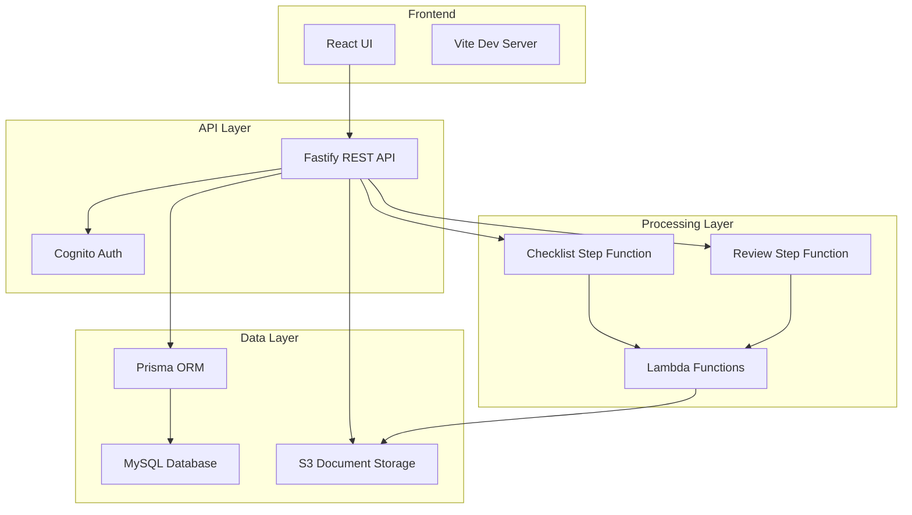

# RAPID System Patterns

## Overall Architecture



## Backend Architecture Pattern

### Layered Architecture

The backend follows a strict layered architecture with unidirectional dependencies:

```
Routes (Presentation) → Use Cases (Application) → Domain (Business Logic)
```

### Domain Layer

- **Models**: Type definitions and domain entities
- **Services**: Business logic implementation
- **Repository**: Data access interfaces and implementations

Example structure:

```typescript
// domain/model/checklist.ts
export interface CheckListSetModel {
  id: string;
  name: string;
  description: string;
  documents: ChecklistDocumentModel[];
}

// domain/repository.ts
export interface CheckRepository {
  storeCheckListSet(params: { checkListSet: CheckListSet }): Promise<void>;
  findAllCheckListSets(): Promise<CheckListSetMetaModel[]>;
}
```

### Use Case Layer

- Orchestrates domain objects
- Implements application-specific logic
- Uses dependency injection for testability

Example pattern:

```typescript
export const createChecklistSet = async (params: {
  req: CreateChecklistSetRequest;
  deps?: { repo?: CheckRepository };
}): Promise<void> => {
  const repo = params.deps?.repo || (await makePrismaCheckRepository());
  // Implementation
};
```

### Presentation Layer

- Route definitions
- Request/response handling
- Input validation

## Frontend Architecture Pattern

### Feature-Based Organization

Each feature is self-contained with its own:

- Components
- Hooks
- Pages
- Types

### Component Hierarchy

1. **Core Components** (src/components): Reusable UI elements
2. **Feature Components** (features/\*/components): Feature-specific UI
3. **Pages** (features/\*/pages): Route-level components

### State Management Pattern

- **SWR** for server state
- **React Context** for global app state (Auth, Toast)
- **Local State** for component-specific state

## Database Patterns

### Entity Relationships

- **Hierarchical Data**: CheckLists with parent-child relationships
- **Many-to-Many**: ReviewJobs to CheckLists through ReviewResults
- **Status Tracking**: All entities have status fields

### Index Strategy

Optimized indexes for common query patterns:

- Composite indexes for multi-column queries
- Single-column indexes for foreign keys
- Specialized indexes for hierarchical queries

## Workflow Patterns

### Step Functions Architecture

Two main workflows:

1. **Document Processing Workflow**

   - Document upload trigger
   - Page extraction
   - Content analysis
   - Result aggregation
   - Error handling

2. **Review Processing Workflow**
   - Review job creation
   - Document-checklist matching
   - AI assessment
   - Result storage
   - Status updates

### Error Handling Pattern

- Try-catch at every layer
- Error details stored in database
- Step Functions handle retry logic
- User-friendly error messages

## API Design Patterns

### RESTful Endpoints

Standard REST conventions:

- GET for retrieval
- POST for creation
- PUT/PATCH for updates
- DELETE for removal

### Request/Response Pattern

- Consistent response format
- Type-safe request validation
- Error response standardization

Example:

```typescript
{
  success: boolean;
  data?: T;
  error?: { message: string; code: string };
}
```

## Security Patterns

### Authentication Flow

1. User login via Cognito
2. JWT token generation
3. Token validation on each request
4. Role-based access control

### Document Security

- S3 presigned URLs for uploads
- Time-limited access tokens
- Bucket policies for access control

## Testing Patterns

### Unit Testing

- Test individual functions/methods
- Mock external dependencies
- Focus on business logic

### Integration Testing

- Test with real database
- Verify repository operations
- Test API endpoints

### Test Structure

```typescript
describe("Feature Name", () => {
  describe("Use Case", () => {
    it("should handle specific scenario", async () => {
      // Arrange
      // Act
      // Assert
    });
  });
});
```

## Deployment Patterns

### Infrastructure as Code

- AWS CDK for all infrastructure
- TypeScript for type-safe infrastructure
- Modular construct design

### Environment Management

- Local development with Docker
- Environment variables for configuration
- Feature flags for gradual rollout

## Performance Patterns

### Caching Strategy

- SWR for frontend data caching
- Database query optimization
- S3 object caching

### Scaling Patterns

- Lambda for compute scaling
- RDS for database scaling
- Step Functions for workflow scaling

## Code Quality Patterns

### TypeScript Usage

- Strict mode enabled
- No implicit any
- Comprehensive type definitions
- Interface-first design

### Code Organization

- Single responsibility principle
- Dependency injection
- Clean architecture boundaries
- Consistent naming conventions

## Common Implementation Patterns

### Repository Pattern Implementation

```typescript
export const makePrismaCheckRepository = (
  client: PrismaClient = prisma
): CheckRepository => {
  return {
    async storeCheckListSet(params) {
      // Implementation
    },
    async findAllCheckListSets() {
      // Implementation
    },
  };
};
```

### Error Handling Implementation

```typescript
try {
  const result = await operation();
  return { success: true, data: result };
} catch (error) {
  logger.error("Operation failed", error);
  return { success: false, error: { message: "Operation failed" } };
}
```

### Frontend Hook Pattern

```typescript
export const useChecklistSets = () => {
  const { data, error, isLoading } = useSWR("/api/checklist-sets", fetcher);

  return {
    checklistSets: data,
    isLoading,
    error,
  };
};
```
