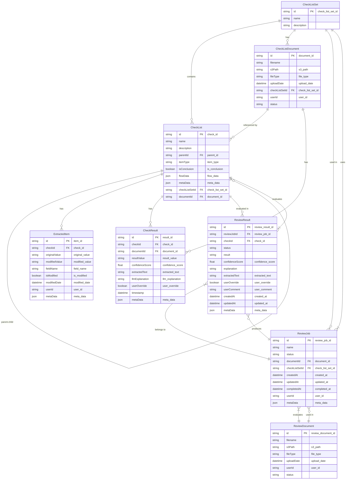

# 審査系 DB スキーマ設計（更新版）

## 概要

審査対象ドキュメントとチェックリストセットを突き合わせ、各チェック項目への適合性を判定するための DB スキーマを設計します。

## ER 図



## 既存モデルの整理

既存の `Document` モデルはチェックリスト作成元のドキュメントを表しています。審査対象のドキュメントを明確に区別するため、既存モデルをリネームし、新たに審査対象ドキュメントのモデルを作成します。

```prisma
// チェックリスト作成元ドキュメント（既存のDocumentをリネーム）
model CheckListDocument {
  id             String        @id @map("document_id") @db.VarChar(26)
  filename       String        @db.VarChar(255)
  s3Path         String        @map("s3_path") @db.VarChar(512)
  fileType       String        @map("file_type") @db.VarChar(50)
  uploadDate     DateTime      @map("upload_date") @db.Timestamp()
  checkListSetId String        @map("check_list_set_id") @db.VarChar(26)
  userId         String?       @map("user_id") @db.VarChar(50)
  status         String        @default("pending") @db.VarChar(20)
  checkListSet   CheckListSet  @relation(fields: [checkListSetId], references: [id])
  checkResults   CheckResult[]
  checkLists     CheckList[]

  @@map("checklist_documents")
}
```

## 新規モデル

### ReviewDocument (審査対象ドキュメント)

審査対象となるドキュメントを管理するためのモデルです。

```prisma
// 審査対象ドキュメント
model ReviewDocument {
  id             String      @id @map("review_document_id") @db.VarChar(26)
  filename       String      @db.VarChar(255)
  s3Path         String      @map("s3_path") @db.VarChar(512)
  fileType       String      @map("file_type") @db.VarChar(50)
  uploadDate     DateTime    @map("upload_date") @db.Timestamp()
  userId         String?     @map("user_id") @db.VarChar(50)
  status         String      @default("pending") @db.VarChar(20)
  reviewJobs     ReviewJob[]

  @@map("review_documents")
}
```

### ReviewJob (審査ジョブ)

審査ジョブを管理するためのモデルです。

```prisma
// 審査ジョブ
model ReviewJob {
  id              String          @id @map("review_job_id") @db.VarChar(26)
  name            String          @db.VarChar(255)
  status          String          @default("pending") @db.VarChar(20) // pending, processing, completed, failed
  documentId      String          @map("document_id") @db.VarChar(26)
  checkListSetId  String          @map("check_list_set_id") @db.VarChar(26)
  createdAt       DateTime        @map("created_at") @db.Timestamp()
  updatedAt       DateTime        @map("updated_at") @db.Timestamp()
  completedAt     DateTime?       @map("completed_at") @db.Timestamp()
  userId          String?         @map("user_id") @db.VarChar(50)
  metaData        Json?           @map("meta_data") @db.Json
  document        ReviewDocument  @relation(fields: [documentId], references: [id])
  checkListSet    CheckListSet    @relation(fields: [checkListSetId], references: [id])
  reviewResults   ReviewResult[]

  @@map("review_jobs")
}
```

### ReviewResult (審査結果)

審査ジョブの各チェック項目に対する結果を格納するモデルです。

```prisma
// 審査結果
model ReviewResult {
  id              String      @id @map("review_result_id") @db.VarChar(26)
  reviewJobId     String      @map("review_job_id") @db.VarChar(26)
  checkId         String      @map("check_id") @db.VarChar(26)
  status          String      @default("pending") @db.VarChar(20) // pending, processing, completed, failed
  result          String?     @db.VarChar(20) // pass, fail
  confidenceScore Float?      @map("confidence_score")
  explanation     String?     @db.Text
  extractedText   String?     @map("extracted_text") @db.Text
  userOverride    Boolean     @default(false) @map("user_override")
  userComment     String?     @map("user_comment") @db.Text
  createdAt       DateTime    @map("created_at") @db.Timestamp()
  updatedAt       DateTime    @map("updated_at") @db.Timestamp()
  metaData        Json?       @map("meta_data") @db.Json
  reviewJob       ReviewJob   @relation(fields: [reviewJobId], references: [id])
  checkList       CheckList   @relation(fields: [checkId], references: [id])

  @@map("review_results")
}
```

## 既存モデルへの関連追加

既存の `CheckListSet` モデルと `CheckList` モデルに関連を追加します。

```prisma
// チェックリストセット
model CheckListSet {
  // 既存のフィールド
  id          String             @id @map("check_list_set_id") @db.VarChar(26)
  name        String             @db.VarChar(255)
  description String?            @db.Text
  checkLists  CheckList[]
  documents   CheckListDocument[] // リネーム後の関連

  // 新規追加
  reviewJobs  ReviewJob[]

  @@map("check_list_sets")
}

// チェックリスト項目
model CheckList {
  // 既存のフィールド
  id             String             @id @map("check_id") @db.VarChar(26)
  name           String             @db.VarChar(255)
  description    String?            @db.Text
  parentId       String?            @map("parent_id") @db.VarChar(26)
  itemType       String             @map("item_type") @db.VarChar(20)
  isConclusion   Boolean            @default(false) @map("is_conclusion")
  flowData       Json?              @map("flow_data")
  metaData       Json?              @map("meta_data")
  checkListSetId String             @map("check_list_set_id") @db.VarChar(26)
  checkListSet   CheckListSet       @relation(fields: [checkListSetId], references: [id])
  parent         CheckList?         @relation("CheckListToCheckList", fields: [parentId], references: [id])
  children       CheckList[]        @relation("CheckListToCheckList")
  extractedItems ExtractedItem[]
  checkResults   CheckResult[]
  documentId     String?            @map("document_id") @db.VarChar(26)
  document       CheckListDocument? @relation(fields: [documentId], references: [id]) // リネーム後の関連

  // 新規追加
  reviewResults  ReviewResult[]

  @@map("check_list")
}
```

## スキーマ設計の考慮点

1. **ドキュメントの区別**

   - チェックリスト作成元のドキュメント（`CheckListDocument`）と審査対象のドキュメント（`ReviewDocument`）を明確に区別しました
   - これにより、それぞれの用途に応じた適切な関連付けが可能になります

2. **審査ジョブ (ReviewJob)**

   - 一つの審査ジョブは一つの審査対象ドキュメントと一つのチェックリストセットを関連付けます
   - ステータスは `pending`, `processing`, `completed`, `failed` の 4 種類を持ちます
   - 作成日時、更新日時、完了日時を記録します

3. **審査結果 (ReviewResult)**

   - 審査ジョブの各チェック項目に対する結果を格納します
   - 結果は `pass`, `fail` の 2 種類のみとします（フィードバックに基づき `warning` を削除）
   - LLM による判定理由と抽出テキストを保存します
   - ユーザーによる上書きと追加コメントを許可します

4. **既存モデルとの関連**

   - `CheckListSet`, `CheckList` モデルに新しい関連を追加します
   - これにより、審査ジョブと審査結果を既存のモデルと関連付けることができます

5. **アプリケーションコードの更新**
   - 既存のコードで `Document` モデルを参照している箇所を `CheckListDocument` に更新する必要があります
   - 関連するリポジトリ、サービス、コントローラーなどを適切に更新します
